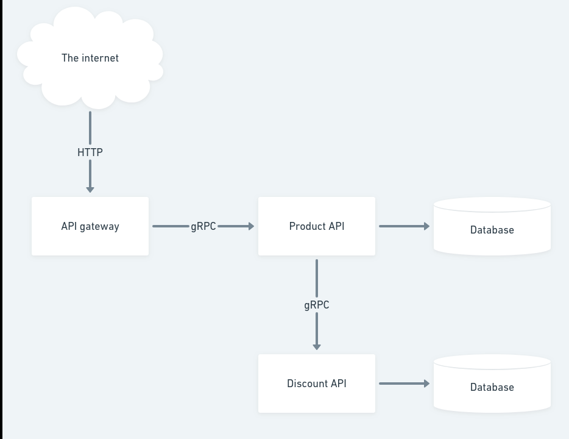

# Marketplace

This project is decomposed in two bounded contexts product and promotion.

## Architecture

Marketplace is composed of two microservices using Go and Python
that talk to each other over gRPC.

[](./docs/img/architecture.png)

| Service            | Language | Decription                                            |
| ------------------ | -------- | ----------------------------------------------------- |
| product            | Go       | Provides the list of products                         |
| promotion          | Python   | Discounts for products                                |
| load               | Python   | Continuously sends requests imitating realistic usage |

## Get started

Clone the repository:

```
git clone https://github.com/wiliamsouza/maketplace.git
```

Get promotion and product repository:

```
git submodule --init

```
If you want update product and promotion code run:

```
git submodule update --remote

```
## Build docker images

```
docker-compose build

```
## Set up database:

Start postgresql:

```
docker-compose up database

```
This will create required database for services and tests.

Create promotion schema:

```
docker run --network marketplace_internal --env-file promotion/docker.env --entrypoint /usr/local/bin/promotionctl --rm marketplace_promotion database create schema

```
Create product schema:

Enter product directory:

```
cd product/

```
Create schemas:

```
make migrate

```
Populate the database with products:

```
make populate

```
Stop docker compose hiting CTRL-C and start all containers running:

## Usage

Start all servers and database:

```
docker-compose up

```
Call product server HTTP REST server product endpoint.

```
curl -v --header http://product.d.wiliam.dev/v1beta1/cataloging/products
```

```
curl -v --header "X-USER-ID: <uuid>" http://product.d.wiliam.dev/v1beta1/cataloging/products
```

The commands above are suppose to work on linux.

If you have some thoube use the follow changing `127.0.0.1` to external address of your doc.

```
curl --header "Host: product.d.wiliam.dev" http://127.0.0.1/v1beta1/cataloging/products
```
